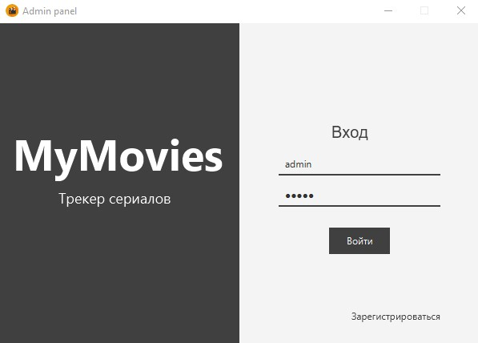
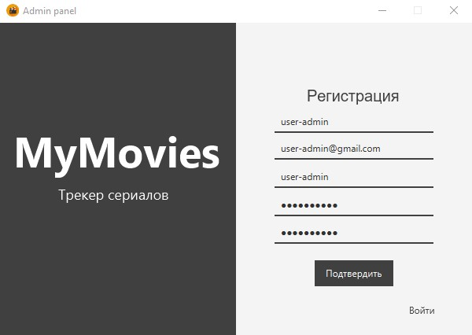
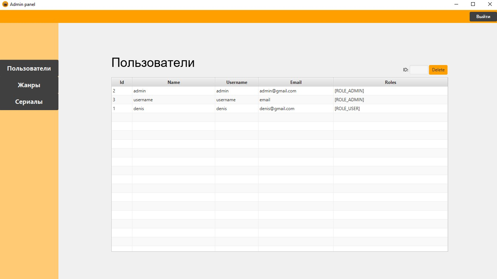
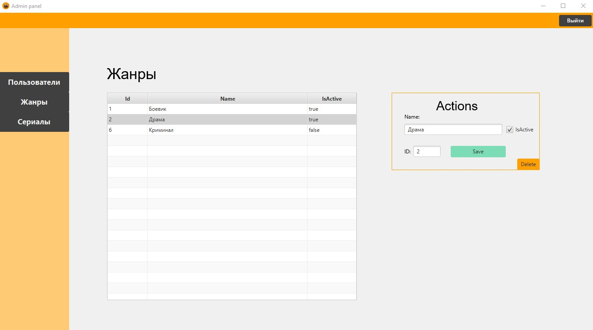
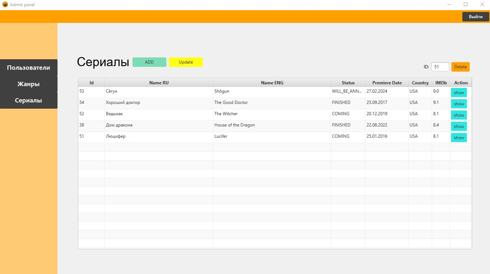
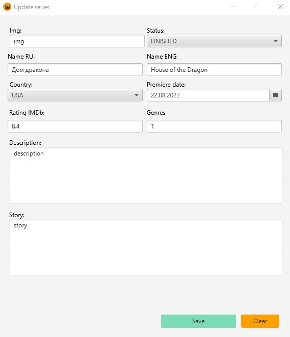
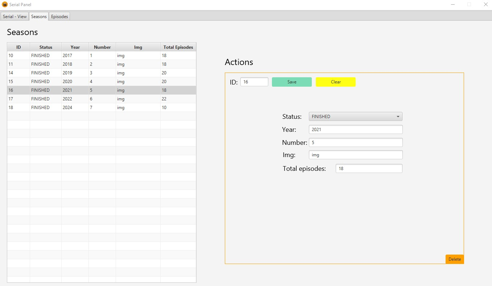
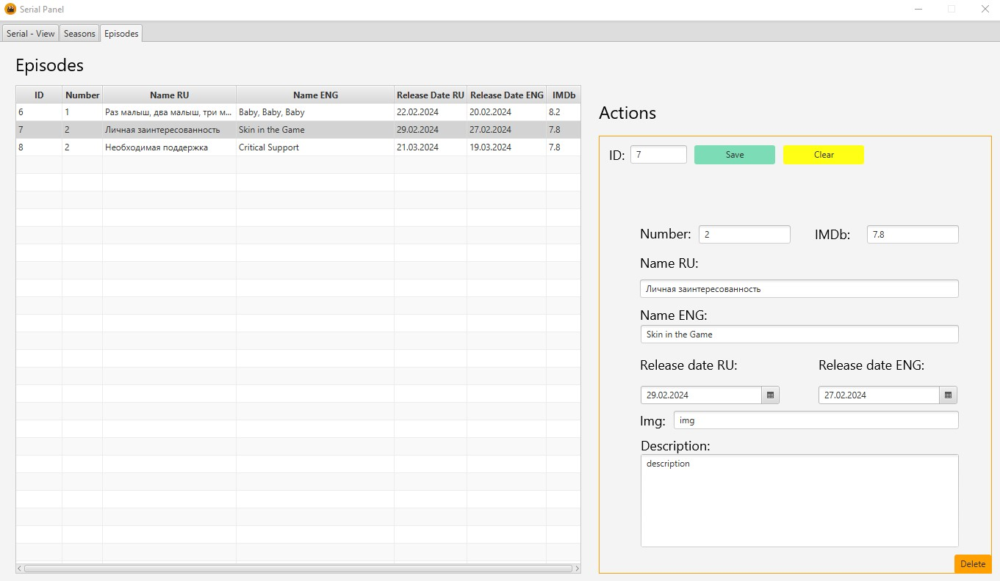

Java Spring MYMovies project - admin
============================
Admin panel for project MyMovies

### Technology

* Java 21
* controlsfx-11.2.1

## Approach

* Need to clone this respiratory.
* Need to clone movies-core and configuration(Without this not working)
* Run this project as part of java code through Idea IDE or command prompts.

## Devices

* Monitor: Resolution 1366 x 768

## Screenshots

### User Login

### User Registration

### User Page

### Genres Page

### Series Page

### Create/Update Series Page

### Season Page

### Episode Page

